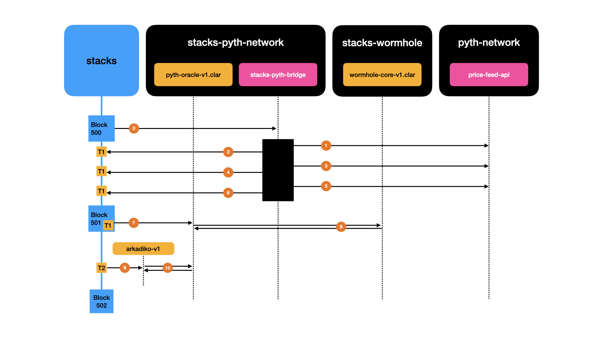

# Bridging Pyth to the Stacks blockchain

Stacks is a blockchain linked to Bitcoin by its consensus mechanism that spans the two chains, called Proof of Transfer. This enables Stacks to leverage Bitcoin’s security and enables Stacks apps to use Bitcoin’s state.
Stacks is a Bitcoin layer that enables decentralized apps and smart contracts.

Pyth Network is an oracle that publishes financial market data to multiple blockchains. Our market data is contributed by over 80 first-party publishers, including some of the biggest exchanges and market making firms in the world. We offer price feeds for a number of different asset classes, including US equities, commodities, and cryptocurrencies. Each price feed publishes a robust aggregate of publisher prices that updates multiple times per second.
Price feeds are available on multiple blockchains and can also be used in off-chain applications. Pyth offers two sets of price feeds for different applications:

## Setup and Test a Devnet Bridge

The bridge is being operated through an offchain service `stacks-pyth-bridge` and a set of contracts implementing the core functionalities specified by the Wormhole protocol, along with . 

The contracts are developped in Clarity and is using Clarinet for its test harnessing.
This guide is assuming that a recent installation of Clarinet (available on brew and winget) is available locally. 

Git clone and compile **stacks-pyth-bridge**

```bash
$ git clone https://github.com/hirosystems/stacks-pyth-bridge.git
$ cd stacks-pyth-bridge
```

Start a local Devnet using the command:
```bash
$ clarinet integrate
```

In another console, the service can be compiled and installed using the command:

```bash
$ cd stacks-pyth-bridge/node
$ cargo install --path .
```

Once installed, a config can be generated using the command:

```bash
$ stacks-pyth-bridge config new
```

A typical valid config looks like this:

```toml
[pyth]
network = "mainnet"
price_service_url = "https://xc-mainnet.pyth.network"
price_feeds_ids = [
    # "0xf9c0172ba10dfa4d19088d94f5bf61d3b54d5bd7483a322a982e1373ee8ea31b", # BTC-USD (testnet)
    # "0xc2703fcc925ad32b6256afc3ebad634970d1b1ffb3f4143e36b2d055b1dcd29b", # STX-USD (testnet)
    "0xe62df6c8b4a85fe1a67db44dc12de5db330f7ac66b72dc658afedf0f4a415b43", # BTC-USD (mainnet)
]
# Price feeds ids available here: https://pyth.network/developers/price-feed-ids

[stacks]
network = "devnet"
stacks_node_rpc_url = "http://localhost:20443"
pyth_oracle_contract_address = "ST1PQHQKV0RJXZFY1DGX8MNSNYVE3VGZJSRTPGZGM.pyth-price-feed-oracle-v1"
mnemonic = "prevent gallery kind limb income control noise together echo rival record wedding sense uncover school version force bleak nuclear include danger skirt enact arrow"
derivation_path = "m/44'/5757'/0'/0/0"
start_block = 6

[bridge]
price_updates_per_minute = 5
enable_rbf = true
enable_microbloks = true

[event_observer]
ingestion_port = 10000
```

After reviewing the generated config, the service can be tested using the command:

```bash
$ stacks-pyth-bridge service ping --config-path Bridge.toml
```

After validating that the service is able to connect to the Price API service and the Stacks chain, the service can be ran with the command:

```bash
$ stacks-pyth-bridge service start --config-path Bridge.toml
```

The operator will start fetching prices from the Pyth network Price API, and submit these Verified Action Attestation to the Pyth contract. The Pyth contract is submitting these VAAs to the wormhole contract, ensuring that the guardians correctly signed the payloads.




## How to consume the price feeds


### Onchain

The `pyth-oracle-v1` contract is exposing the following readonly method:

```clarity
(define-read-only (read-price-feed 
    (price-feed-id (buff 32))))
```
 
That can be consumed with the following invocation:

```clarity
(contract-call? 
    'ST1PQHQKV0RJXZFY1DGX8MNSNYVE3VGZJSRTPGZGM.pyth-price-feed-oracle-v1  ;; Address of the oracle contract
    0xf9c0172ba10dfa4d19088d94f5bf61d3b54d5bd7483a322a982e1373ee8ea31b)
```

The authenticity of the price feeds are verified during their ingestion, making the cost of queries as light as it could be.

Each Pyth Network price feed is referred to via a unique id. Price feeds also have different ids in mainnets than testnets or devnets. The full list of price feeds is listed on the [pyth.network website](https://pyth.network/price-feeds/). The price feed ids page lists the id of each available price feed on every chain where they are available. To use a price feed on-chain, look up its id using these pages, then store the feed id in your program to use for price feed queries.

Price Feeds usage and best practices are described on the [pyth.network developer documentation website](https://docs.pyth.network/pythnet-price-feeds/best-practices). 


### Offchain

For every new price recorded and stored on chain, the `pyth-oracle-v1` is emitting an event with the following shape:

```clarity
(print { 
    type: "price-feed", 
    action: "updated", 
    data: { 
        attestation-time: u1686854317, 
        conf: u2064471426, 
        ema-conf: u1891952230, 
        ema-price: 2507095440000, 
        expo: 4294967288, 
        prev-conf: u2064471426, 
        prev-price: 2515455528574, 
        prev-publish-time: u1686854316, 
        price: 2515455528574, 
        publish-time: u1686854317, 
        status: u1
     } })
```

These events can be observed using [Chainhook](https://github.com/hirosystems/chainhook), using the `print` predicates.